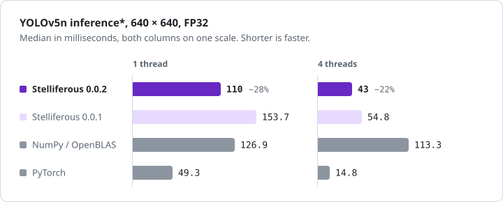

<div align="center">


# Stelliferous

以 [Bend](https://github.com/bendlang/bend) 寫成、也以 Bend 證明的張量與卷積函式庫。

[開始使用](docs/getting_started.zh-TW.md) | [API 參考](lib/README.zh-TW.md) | [證明](docs/proofs.zh-TW.md) | [效能](docs/performance.zh-TW.md)

[](scripts/toolchain.json)
[](docs/proofs.zh-TW.md)
[](docs/design.zh-TW.md)
[](#授權)

[English](README.md) | [繁體中文](README.zh-TW.md)

</div>

---

Stelliferous 是基於 Bend 2 的張量函式庫，提供卷積網路需要的運算，目前支援 F32 的運算。

## 開始使用

安裝 [Bend](https://github.com/bendlang/bend) 與 Clang，然後從 BendHub 匯入函式庫：

```python
import stelliferous@0.0.2.0/tensor_f32.bend as F
import stelliferous@0.0.2.0/math_activation.bend as Act
```

套件以官方 Bend v2.0.36 檢查。要執行本庫的證明與效能量測，請見[開始使用](docs/getting_started.zh-TW.md)。

## 範例

[examples/array_basics.bend](examples/array_basics.bend)：

```python
import Base
import stelliferous@0.0.2.0/tensor_f32.bend as F
import stelliferous@0.0.2.0/math_activation.bend as Act

def main() -> List<&2,F32>:
  # 1.0 到 16.0，排成 [batch, channels, height, width]
  image   = F.reshape(F.arange(1.0,16),[1,1,4,4])
  # [輸出通道, 輸入通道, kernel 高, kernel 寬]
  weights = F.ones([1,1,3,3])
  # 每個輸出通道一個值
  bias    = F.zeros([1])
  # stride 1、padding 1，再做 ReLU：大小維持 4x4
  feature = F.conv2d(image,weights,bias,1,1,Act.relu())
  # 2x2 視窗：4x4 -> 2x2
  pooled  = F.max_pool2d(feature,2)
  # 讀出數值。上面任何一步失敗就回傳 []
  F.to_list_or(pooled,[])
```

編譯並執行，會印出 `[54.0, 63.0, 90.0, 99.0]`。

```sh
bend array_basics.bend -o array_basics
./array_basics
```

其他：[小型網路](examples/small_network.bend)、[儲存與載入](examples/save_and_load.bend)、[YOLOv5n](examples/yolov5/README.zh-TW.md)。

## 證明

對每一個輸入，原生卷積都等於它的矩陣規格，每個位元相同，不論 worker 數。由官方 Bend 檢查器檢查：

```sh
python run.py proofs
```

```text
law native_inference_matches_matrix:
  for +problem: ConvSpec.Problem
  {NativeConv.infer(problem) == MatrixSpec.infer(problem) : ConvSpec.ConvOutcome}
```

## 效能

<picture>
  <source media="(prefers-color-scheme: dark)" srcset="docs/performance_dark.svg">
  
</picture>

\* 只含模型計算，不包含影像載入、前處理與 NMS。

在 Google Cloud 的 `c4d-standard-8` 虛擬機（AMD EPYC 9B45，8 個虛擬 CPU）上量測。量測方式與樣本見[效能](docs/performance.zh-TW.md)。

## 文件

[開始使用](docs/getting_started.zh-TW.md) · [API 參考](lib/README.zh-TW.md) · [設計](docs/design.zh-TW.md) · [證明](docs/proofs.zh-TW.md) · [效能](docs/performance.zh-TW.md) · [開發](docs/development.zh-TW.md) · [更新紀錄](CHANGELOG.zh-TW.md)

## 授權

採 [MIT](LICENSE-MIT) 或 [Apache License 2.0](LICENSE-APACHE) 授權，由使用者擇一。內附的 YOLOv5 權重與影像保留其[上游授權](data/README.zh-TW.md)。
